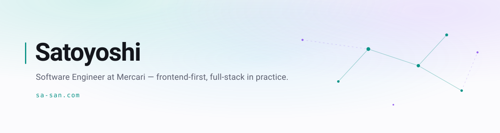

  <picture>
    <source media="(prefers-color-scheme: dark)" srcset="assets/banner-dark.svg">
    <source media="(prefers-color-scheme: light)" srcset="assets/banner-light.svg">
    
  </picture>

  I build small tools that remove friction from my own workflow, then ship them. 
  <a href="https://sa-san.com">sa-san.com</a>

## Now

- Frontend engineer on Mercari's Customer Service platform, working across the stack.
- Shipping side projects as SA-SAN Studio — a word game on the App Store, a Chrome extension, a couple of Go CLIs.
- Automating my own development loop: agent skills, hooks, and a knowledge base that rewrites itself when I repeat a mistake.

## Shipped

<!-- SHIPPED:START -->

- **[MagPoint](https://chromewebstore.google.com/detail/mcflgbjfkamejadmpepkjbndfaakbndl)** `v0.3.0` — Chrome extension that pulls the cursor toward the nearest clickable element. Pointing assist, not a cursor skin. [Source](https://github.com/satocchi0416sh/magpoint)
- **[moji-sand](https://apps.apple.com/jp/app/id6780945669)** — A word game you can play once a day. React Native, on the App Store.
- **[cortex](https://github.com/satocchi0416sh/cortex)** `v0.1.0` — Go CLI that idempotently syncs local AI memory files into Notion, running under launchd.
- **[dotgo](https://github.com/satocchi0416sh/dotgo)** — Tag-based dotfiles manager. One `dotgo.yaml`, no directory gymnastics.
- **[typed-notion-cli](https://github.com/satocchi0416sh/typed-notion-cli)** — Generates type-safe TypeScript schemas from Notion data sources.

<!-- SHIPPED:END -->

## Writing

<!-- WRITING:START -->

- ♥ 204 &nbsp;[【緊急】Next.js (CVE-2025-66478) / React (CVE-2025-55182) の脆弱性について](https://zenn.dev/satoyoshi/articles/05389491886cac)
- ♥ 17 &nbsp;[Claude Codeが生成するAIメモをNotionに逃がすCLIを作った話 — Obsidianを見送った現実的な選択](https://zenn.dev/satoyoshi/articles/2fe1c89e825e31)
- ♥ 3 &nbsp;[Next.js (Edge Runtime) の Route Handler テストでつまずいた話と、その解決策](https://zenn.dev/fristi_blog/articles/0533853b3123e8)
- ♥ 2 &nbsp;[クリックできる場所に吸い付く液体ガラスのカーソルを、Chrome拡張で作った](https://zenn.dev/satoyoshi/articles/liquid-glass-magnetic-cursor)
- ♥ 2 &nbsp;[AIに同じ指示を繰り返すのをやめた ―― Skillを自己修復させる「再発防止ループ」](https://zenn.dev/satoyoshi/articles/2428152fefdd92)

<!-- WRITING:END -->

More on [Zenn](https://zenn.dev/satoyoshi).

## How I work

Almost everything here started as friction in my own day. When I catch myself giving an AI agent the same correction twice, I stop and turn it into a rule the agent loads on its own — so the fix outlives the session.

That habit is why `cortex` and `dotgo` exist: the knowledge base needed somewhere durable to live, and the machines needed to agree on what "my setup" means.

## Stack

TypeScript · Go · React / Next.js · React Native · C# (Unity) · PHP

## Links

[X](https://x.com/satoyoshi416) · [support@sa-san.com](mailto:support@sa-san.com)
